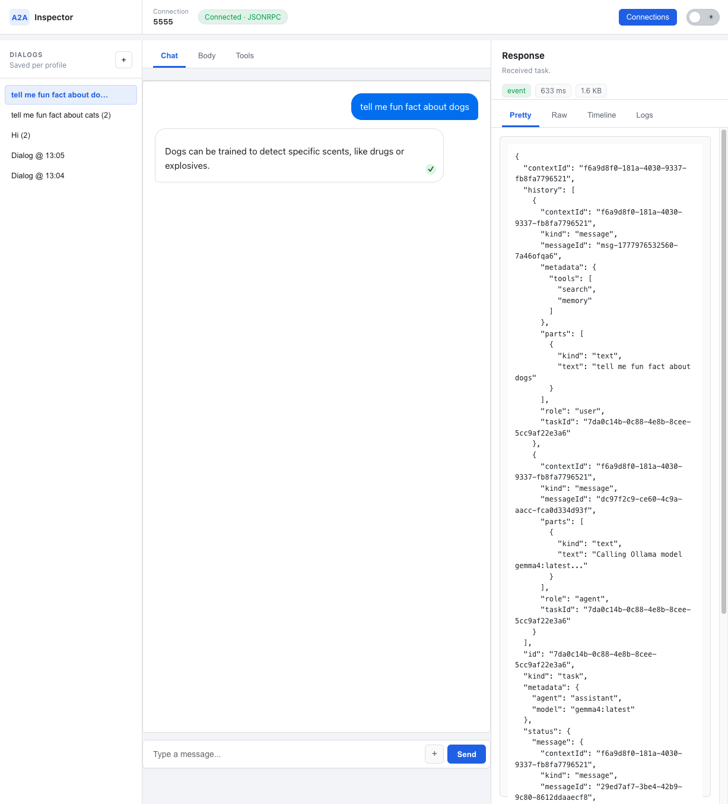
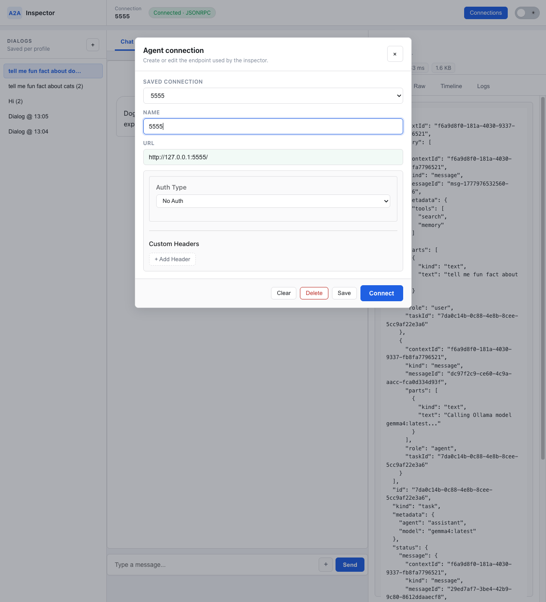

# A2A Inspector

The A2A Inspector is a web-based tool for inspecting, debugging, and validating servers that implement the A2A (Agent2Agent) protocol. It gives developers a focused workspace for connecting to an agent, sending requests, reviewing responses, and checking protocol compliance.

The application is built with a FastAPI backend and a TypeScript frontend.

## Features

- **Saved connections:** Store and reuse agent endpoints, authentication settings, and custom headers.
- **Dialog history:** Keep conversations per saved profile, replay prior dialogs, and resume with the preserved context ID.
- **Agent card validation:** Fetch the agent card, display it as JSON, and surface validation errors.
- **Chat workspace:** Send messages and file attachments from a focused chat panel.
- **Request editor:** Inspect and edit the request body JSON before sending, including metadata and selected tools.
- **Response inspector:** Review formatted responses, raw payloads, timeline events, and logs side by side.
- **Protocol debugging:** Capture request, response, validation, and error logs for deeper troubleshooting.

## Interface Overview

The workspace is organized into three primary areas:

- **Top bar:** Shows the active connection, connection status, saved connection manager, and theme toggle.
- **Left sidebar:** Lists saved dialogs for the active profile and lets you start a new dialog.
- **Main workspace:** Provides the chat, request body, and tools tabs.
- **Response panel:** Shows the latest response metadata, pretty/raw payloads, timeline, and logs.



The connection manager keeps endpoint, auth, and header settings together so repeated local testing is quick.



## Prerequisites

- Python 3.10+
- [uv](https://github.com/astral-sh/uv)
- Node.js and npm

## Project Structure

This repository is organized into two main parts:

- `./backend/`: Contains the Python FastAPI server that handles WebSocket connections and communication with the A2A agent.
- `./frontend/`: Contains the TypeScript and CSS source files for the web interface.

## Setup and Running the Application

Follow these steps to get the A2A Inspector running on your local machine. The setup is a three-step process: install Python dependencies, install Node.js dependencies, and then run the two processes.

### 1. Clone the repository

```sh
git clone https://github.com/a2aproject/a2a-inspector.git
cd a2a-inspector
```

### 2. Install Dependencies

First, install the Python dependencies for the backend from the root directory. `uv sync` reads the `uv.lock` file and installs the exact versions of the packages into a virtual environment.

```sh
# Run from the root of the project
uv sync
```

Next, install the Node.js dependencies for the frontend.

```sh
# Navigate to the frontend directory
cd frontend

# Install npm packages
npm install

# Go back to the root directory
cd ..
```

### 3. Run the Application

You can run the A2A Inspector in two ways. Choose the option that best fits your workflow:

- Option 1 (Run Locally): Best for developers who are actively modifying the code. This method uses two separate terminal processes and provides live-reloading for both the frontend and backend.
- Option 2 (Run with Docker): Best for quickly running the application without managing local Python and Node.js environments. Docker encapsulates all dependencies into a single container.

#### Option 1: Run Locally

This approach requires you to run two processes concurrently. You can either use the provided convenience script or run them separately in different terminals.

**Using the convenience script (recommended):**

```sh
# Make the script executable (first time only)
chmod +x scripts/run.sh

# Run both frontend and backend with a single command
bash scripts/run.sh
```

This will start both the frontend build process and backend server, displaying their outputs with colored prefixes. Press `Ctrl+C` to stop both services.

**Or manually in separate terminals:**

Make sure you are in the root directory of the project (`a2a-inspector`) before starting.

**In your first terminal**, run the frontend development server. This will build the assets and automatically rebuild them when you make changes.

```sh
# Navigate to the frontend directory
cd frontend

# Build the frontend and watch for changes
npm run build -- --watch
```

**In a second terminal**, run the backend Python server.

```sh
# Navigate to the backend directory
cd backend

# Run the FastAPI server with live reload
uv run app.py
```

##### Access the Inspector

Once both processes are running, open your web browser and navigate to:
**[http://127.0.0.1:5001](http://127.0.0.1:5001)**

#### Option Two: Run with Docker

This approach builds the entire application into a single Docker image and runs it as a container. This is the simplest way to run the inspector if you have Docker installed and don't need to modify the code.

From the root directory of the project, run the following command. This will build the frontend, copy the results into the backend, and package everything into an image named a2a-inspector.

```sh
docker build -t a2a-inspector .
```

Once the image is built, run it as a container.

```sh
# It will run the container in detached mode (in the background)
docker run -d -p 8080:8080 a2a-inspector
```

The container is now running in the background. Open your web browser and navigate to:
**[http://127.0.0.1:8080](http://127.0.0.1:8080)**

### 4. Inspect your agents

- Open **Connections** and add an agent endpoint such as `http://127.0.0.1:5555`.
- Save the profile if you want dialog history to persist for that endpoint.
- Use **Chat** for regular message testing, **Body** for request JSON inspection, and **Tools** to toggle tool metadata.
- Check the **Response** panel for formatted output, raw payloads, timeline entries, and logs.
